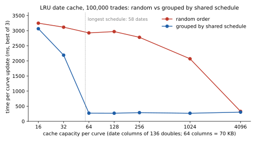

# benchmark_paper — the §9 workload and historical timing record

Reproduces the table in §9 of the paper: 500,000 instruments, half semi-annual fixed-rate bonds and half
annual-30/360-vs-6M-Act/360 swaps, maturities 1–29y, on the Eonia/Euribor6M curves of QuantLib's
MulticurveBootstrapping example (`quantlib_example_curves.txt`, 30 + 36 forward buckets), 66 sensitivities
per instrument, streaming output. The current source reports first derivatives per unit
instantaneous-forward-rate shift, matching the library and manuscript. The committed 50.9 ms record is older:
that historical executable used interval-integrated-forward coordinates. The two outputs differ only by the
known bucket-length scaling, but the old timing is kept as historical evidence and is not relabelled as a fresh
run of the current source. The broader library/OIS workload is separate — do not mix the generations.

```
g++ -O3 -std=c++20 -march=native -mprefer-vector-width=512 -Wno-unused-result bench_paper.cpp -o bench_paper
./bench_paper 500000 1 3        # N, run baseline (1/0), repetitions
```
Recorded run (`recorded_500k.txt`, one Sapphire Rapids core, 2.1 GHz, VM): baseline 57,445 ms; scalar scan
1,272 ms; 8-lane normal stores 61.4 ms; 8-lane streaming stores 50.9 ms (1.54 ns per sensitivity);
64,034 groups, 97.6% lane occupancy; GRP vs scalar 3.4e-11; BASE vs scalar 2.7e-8.
Historical write-only reference: 270 MiB in 15.7 ms on the same core. The original source/log for that
measurement is not in this repository, so it is context rather than a self-contained reproduction. The
manuscript also distinguishes 270 MiB from the benchmark's 270,479,616-byte padded output.

`write_floor` is the current reproducible write-only benchmark. Its default byte count is exactly 270,479,616;
pass `283115520` to measure 270 MiB. `recorded_2026-10-06_write_floor.txt` is a fresh cloud-host run and is
explicitly not the historical 15.7 ms measurement.
`recorded_sweep.txt` is the working-set staircase (10k–500k).

## Adjoint baselines (`adjoint_bench.cpp`)

Same book and curves. Scalar, one core, replication excluded. `g++ -O3 -std=c++20 -march=native -I../.. adjoint_bench.cpp -o adjoint_bench && ./adjoint_bench 500000 2`

| | 500k | ns / sensitivity |
|---|---|---|
| reverse scan, N+K | 431 ms | 13.1 |
| tape-free N·K overlap adjoint (geometry known) | 726 ms | 22.0 |
| reverse mode with a recorded tape (~2,500 nodes / instrument) | 8,784 ms | 266 |

All agree to 4e-11. The recorded-tape timing includes expression construction, exponentials, tape recording
and reverse traversal; this experiment does not isolate tape-memory traffic or establish the cost of other AAD
implementations. The geometry-aware N·K adjoint is within 1.7x of the scan at scalar level.

The original raw log behind the historical 431/726/8784 ms row has not been recovered.
`recorded_2026-10-06_adjoint_500k.txt` is a fresh current-source run on a different cloud host; it validates the
comparison and correctness gate but does not replace the historical timings.

## LRU date cache: grouping trades by shared schedule (`scenario_bench.cpp`)

This example shows why the order in which trades are priced matters when scenario curves are cached by date.
It computes the 132 wave scenarios (30 discount-curve and 36 projection-curve nodes, each bumped up and down)
for a book of bonds and vanilla swaps by repricing on a scenario-vector curve. Same book specification as the
§9 benchmark.

### How the pricing is vectorised

For each payment date the curve supplies one column of 136 doubles: the discount (or projection) factor at that
date for every scenario, padded from 132 to a multiple of 8. A fixed cashflow is priced with one broadcast of its
amount and a multiply-add down the column, which is 17 AVX-512 FMAs on contiguous memory. The pricing loop has no
per-scenario interpolation and no `exp`; those are done once per column, when the column is filled.

Columns are computed on demand and held in an LRU cache with a fixed number of columns per curve. A miss locates
the curve interval once and fills the column; a hit reuses it. A column is 1,088 bytes, so 64 columns are 70 KB
per curve.

### Why the order matters

Trades on the same schedule pay on the same dates. Priced one after another, ordered by tenor, they reuse the same
columns while those columns are in the cache; when the group ends its columns are evicted and the next group's are
loaded. The cache therefore needs only as many columns as the longest schedule has dates: 58 in this book
(29 years, semi-annual), so 64 columns are enough and 32 are not. A 15-year semi-annual book (30 dates) would need 32.

In random order, consecutive trades use unrelated dates. The cache keeps evicting columns that are needed again
soon, and it stops recomputing them only when it can hold every date in the book.

The floor is each column computed once per curve: 7,020 column evaluations for this book (3,480 dates used by the
discount curve plus 3,540 used by the projection curve).

### Reading the output

A run prints five blocks. From the 500,000-trade run in the table below:

```
scenario_bench: wave scenarios priced from an LRU date cache, single thread
build:     AVX-512 instructions; GCC 13.3.0
book:      500,000 instruments (bonds and vanilla swaps); 3,540 distinct payment dates
...
result: LRU cache, cost of one curve update
  columns     cache  order            time     per output        misses  hit rate
       64     70 KB  random     15151.0 ms      459.12 ns    22,348,094    33.87%
       64     70 KB  sorted      1663.6 ms       50.41 ns        10,500    99.97%
       64     70 KB  grouped     1611.1 ms       48.82 ns         7,020    99.98%
  at 64 columns: grouped is 9.4x faster than random, at the miss floor
```

1. **Header**: the instruction set and compiler the binary was built with, the book, the 132 scenarios and the
   33,000,000 sensitivities they produce (66 per instrument, from central differences of the up/down pairs).
2. **terms**: definitions, including the miss floor for this book (7,020: 3,480 discount-curve dates plus 3,540
   projection-curve dates) and the three orders.
3. **result**: the demonstration. One row per cache size and order; time is for one curve update, starting from an
   empty cache. The last lines give grouped against random at each cache size, and say when grouped is at the floor.
   Above 100,000 trades the random rows below 1,024 columns are not run unless `LRU_ALL=1` is set, and the output
   says so.
4. **context**: the same book priced from a full table (every date's column computed up front, no cache), the cost
   of building that table per curve update, and the scalar reverse scan, which computes the sensitivities directly
   without scenarios. With the baseline argument set to 1, a per-scenario repricing row (BASE) and speed-ups against
   it are added.
5. **accuracy and correctness gate**: every full-table and cache run, and BASE when it is run, is compared with
   the scalar scan, relative to max(|value|, 1e4). The output gives the largest difference and the run it came
   from; about 5e-8 is the truncation error of the central difference at eps = 1e-5. The gate fails if any run
   differs by more than 1e-6 or produces a non-finite value; the program then names the run and exits with status 1.

Malformed arguments, curve files and `LRU_CAPS` values are rejected with a message and exit status 1. In the
`release` preset on a machine with AVX-512, the CTest test `scenario_bench_gate_and_input_checks` runs a small gated
case and those rejections.

### Results

The manuscript has used more than one historical VM timing for the 64-column random/sorted comparison.
The committed raw files are authoritative for their own runs; do not combine rows from different files into a
single run identity. `recorded_lru_500k_cap64_both_orders.txt`, `recorded_lru_500k.txt` and the tables below are
distinct observations. The ordering effect is reproducible; absolute VM timings vary substantially.




Three orders are measured: **random** (shuffled); **sorted** (instrument type, then start date, then tenor); and
**grouped** (start date, then type, then tenor, so trades sharing a schedule are adjacent; a prototype ordering in the
code). Misses are column evaluations, both curves together; time is per curve update, best of 3 runs.

100,000 trades:

| columns per curve | cache per curve | random: misses | random: time | sorted: misses | sorted: time | grouped: misses | grouped: time |
|---:|---:|---:|---:|---:|---:|---:|---:|
| 16 | 17 KB | 5,185,875 | 3,248 ms | 4,778,344 | 3,005 ms | 4,778,344 | 3,065 ms |
| 32 | 35 KB | 4,842,108 | 3,116 ms | 3,264,181 | 2,149 ms | 3,264,181 | 2,189 ms |
| **64** | **70 KB** | **4,469,511** | **2,926 ms** | **10,500** | **272 ms** | **7,020** | **270 ms** |
| 128 | 139 KB | 4,366,199 | 2,970 ms | 10,500 | 267 ms | 7,020 | 268 ms |
| 256 | 279 KB | 4,154,015 | 2,780 ms | 10,500 | 268 ms | 7,020 | 287 ms |
| 1,024 | 1.1 MB | 2,889,082 | 2,070 ms | 10,500 | 267 ms | 7,020 | 266 ms |
| 4,096 | 4.5 MB | 7,020 | 328 ms | 7,020 | 308 ms | 7,020 | 304 ms |

At 64 columns the hit rates are 33.8% random, 99.84% sorted and 99.90% grouped.

500,000 trades, 64 columns per curve, best of 2 runs:

| order | misses | hit rate | time |
|---|---:|---:|---:|
| random | 22,348,094 | 33.87% | 15,151 ms |
| sorted | 10,500 | 99.97% | 1,664 ms |
| grouped | 7,020 | 99.98% | 1,611 ms |

At 64 columns, grouped order is 9.4x faster than random order at 500,000 trades and computes 3,184 times fewer
columns. Its misses do not grow with the book (7,020 at both sizes), because they depend only on the number of
distinct dates; random-order misses grow with the number of trades.

The same 500,000-trade comparison on a second set-up (HP Omen 45L desktop with AVX-512, Windows, MSVC 19.44 with
`/fp:contract`):

| order | misses | hit rate | time |
|---|---:|---:|---:|
| random | 22,366,506 | 33.81% | 30,608 ms |
| sorted | 10,500 | 99.97% | 3,030 ms |
| grouped | 7,020 | 99.98% | 3,060 ms |

Grouped is 10.0x faster than random there. Absolute times differ by about 2x between the two set-ups, which differ
in both machine and compiler; the ratios and the sorted and grouped miss counts carry over. Before MSVC was given
`/fp:contract`, the same rows took 5 to 15% longer on that machine. That is consistent with contraction allowing
FMA instructions in the pricing loops, which are plain C++ that the compiler vectorises; the machine code was not
inspected.

The 100,000-trade table and the first 500,000-trade table were measured on one core of an Intel Xeon VM at 2.1 GHz
(48 KB L1d, 2 MB L2), GCC 13.3, AVX-512. Miss counts and hit rates are deterministic for a given standard library
(fixed seeds). The book and the random order are generated with `std::uniform_int_distribution` and `std::shuffle`,
whose algorithms differ between standard libraries, so the random-order miss count differs slightly between GCC and
MSVC builds (22,348,094 and 22,366,506 above). Times vary between runs, by 20% or more on the VM. The two recorded
500,000-trade runs at 64 columns, sorted (`recorded_lru_500k_cap64_both_orders.txt` and `recorded_lru_500k.txt`),
differ by a factor of two.

### Sorted against grouped: the 10,500 misses

The sorted order prices all bonds before all swaps. A swap pays on the same discount dates as a bond with the same
start date, but by the time the swaps are priced those columns have been evicted. At 64 columns the projection
curve is at its floor (3,540 misses) and the discount curve has 6,960: every discount column is computed twice.

The grouped order puts bonds and swaps that share dates next to each other, and reaches the floor of 7,020 at 64
columns. Here the 3,480 extra fills in sorted order cost little next to the pricing itself, so the two run in about
the same time; the large difference is between random order and either schedule-based order.

In a seasoned book, where schedules are generated backwards from the last regular payment date, the
corresponding grouping key is the last regular payment date (its position in the payment cycle), then maturity.

### Reproducing

Built by the `release` preset with the AVX-512 variant, on GCC, Clang and MSVC; it needs a CPU with AVX-512.
From `build/release/examples/benchmark_paper`:

```
LRU_CAPS=16,32,64,128,256,1024,4096 ./scenario_bench 100000 0 3   # the 100,000-trade sweep above
LRU_ALL=1 LRU_CAPS=64 ./scenario_bench 500000 0 2                 # the 500,000-trade comparison at 64 columns
```

Arguments are trades, baseline (1 adds the per-scenario repricing baseline) and repetitions. Above 100,000 trades
the random-order runs below 1,024 columns are skipped unless `LRU_ALL=1` is set. In PowerShell, set the variables
first, for example `$env:LRU_ALL = '1'; $env:LRU_CAPS = '64'`, and clear them afterwards with
`Remove-Item Env:LRU_ALL, Env:LRU_CAPS`; with the Visual Studio generator the executable is in a `Release`
subfolder. The program changes into its own data directory, so it can be run from anywhere.

CLion configurations: `scenario_bench 100k (LRU date cache)` runs the default sweep with the baseline;
`scenario_bench 500k (64 columns, all orders)` sets `LRU_ALL=1` and `LRU_CAPS=64` and reproduces the 500,000-trade
table. Standalone:
`g++ -O3 -std=c++20 -march=native -ffp-contract=fast -I../.. -Wno-unused-result scenario_bench.cpp -o scenario_bench`.
